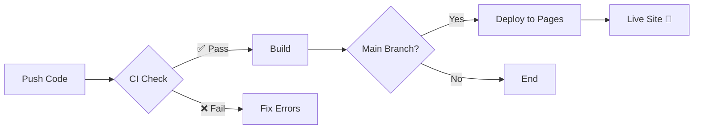

# 🚀 Guide de Déploiement CI/CD

## ✨ Configuration Terminée !

Votre portfolio dispose maintenant d'un système **CI/CD complet** avec GitHub Actions !

---

## 📋 Ce qui a été configuré

### 1. **CI - Build & Test** (`.github/workflows/ci.yml`)
Exécuté sur **chaque push** et **pull request** :

- ✅ Teste le build sur Node.js 18.x et 20.x
- ✅ Vérifie le formatage Prettier
- ✅ Construit le projet
- ✅ Vérifie que les artifacts sont générés

### 2. **CD - Deploy to GitHub Pages** (`.github/workflows/deploy.yml`)
Exécuté sur **push vers main/master** :

- ✅ Build automatique du projet
- ✅ Déploiement automatique sur GitHub Pages
- ✅ URL publique générée automatiquement

---

## 🎯 Pour Activer GitHub Pages

### Étape 1 : Push vers GitHub

```bash
# Initialiser Git (si pas déjà fait)
git init
git add .
git commit -m "feat: add CI/CD workflows and code quality improvements"

# Créer un repo sur GitHub, puis :
git remote add origin https://github.com/VOTRE-USERNAME/VOTRE-REPO.git
git branch -M main
git push -u origin main
```

### Étape 2 : Activer GitHub Pages

1. Allez sur votre repo GitHub
2. Settings → Pages
3. Source : **GitHub Actions**
4. Sauvegardez

### Étape 3 : Attendez le Déploiement

- Le workflow se lance automatiquement
- Temps estimé : ~2-3 minutes
- URL disponible dans : Settings → Pages

---

## 🔧 Scripts NPM Disponibles

### Développement
```bash
npm run dev              # Lance le serveur de dev (http://localhost:8080)
npm run preview          # Prévisualise le build de production
```

### Build
```bash
npm run build            # Build de production
npm run build:dev        # Build de développement
```

### Qualité de Code
```bash
npm run format           # Auto-formate le code avec Prettier
npm run format:check     # Vérifie le formatage (utilisé par CI)
npm run lint             # Vérifie le code avec ESLint
```

---

## 🛡️ Badges pour votre README

Ajoutez ces badges à votre `README.md` :

```markdown


```

Remplacez `VOTRE-USERNAME` et `VOTRE-REPO` par vos valeurs.

---

## 📊 Workflow CI/CD



### Déclencheurs :

1. **CI Build & Test** :
   - Push sur `main`, `master`, `dev`
   - Pull requests vers `main`, `master`

2. **Deploy to Pages** :
   - Push sur `main`, `master` uniquement
   - Déclenchement manuel via GitHub UI

---

## 🔍 Vérifier le Statut

### Via GitHub
1. Allez sur votre repo
2. Onglet **Actions**
3. Voir tous les workflows en cours

### Via Badge
Le badge dans le README affiche :
- 🟢 Vert = Succès
- 🔴 Rouge = Échec
- 🟡 Jaune = En cours

---

## 🐛 Dépannage

### ❌ Le build échoue
```bash
# Tester localement
npm run build

# Si erreurs, les corriger puis :
git add .
git commit -m "fix: resolve build errors"
git push
```

### ❌ Le formatage échoue
```bash
# Auto-formater le code
npm run format

# Commit
git add .
git commit -m "style: auto-format code with prettier"
git push
```

### ❌ GitHub Pages ne se déploie pas
1. Vérifiez Settings → Pages → Source = "GitHub Actions"
2. Vérifiez que le workflow `deploy.yml` a bien run
3. Vérifiez les logs dans Actions

---

## 📦 Structure des Workflows

```
.github/
└── workflows/
    ├── ci.yml        # Tests et build à chaque push
    └── deploy.yml    # Déploiement automatique sur Pages
```

---

## 🎉 Résultat Final

Une fois déployé, votre portfolio sera accessible à :

```
https://VOTRE-USERNAME.github.io/VOTRE-REPO/
```

### Exemple :
```
https://papa-bothie.github.io/lumina-portfolio/
```

---

## 🚀 Workflow de Développement Recommandé

1. **Créer une branche** :
   ```bash
   git checkout -b feature/ma-nouvelle-feature
   ```

2. **Développer** :
   ```bash
   npm run dev
   # Faites vos modifications
   ```

3. **Tester localement** :
   ```bash
   npm run build
   npm run format:check
   ```

4. **Commit et push** :
   ```bash
   git add .
   git commit -m "feat: add new feature"
   git push origin feature/ma-nouvelle-feature
   ```

5. **Pull Request sur GitHub** :
   - Le CI s'exécute automatiquement
   - Si ✅, merge vers `main`
   - Le déploiement se fait automatiquement !

---

## 📈 Avantages du CI/CD

✅ **Qualité garantie** - Chaque push est testé  
✅ **Déploiement automatique** - Plus besoin de déployer manuellement  
✅ **Historique complet** - Toutes les versions sont tracées  
✅ **Rollback facile** - Retour arrière en 1 clic  
✅ **Collaboration fluide** - Les PRs sont testées automatiquement  

---

## 🎯 Prochaines Étapes

1. ✅ **Pusher le code vers GitHub**
2. ✅ **Activer GitHub Pages**
3. ✅ **Attendre le premier déploiement**
4. 🎉 **Partager votre portfolio !**

---

**Bon déploiement ! 🚀**
